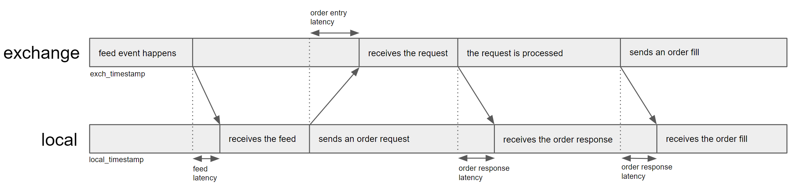
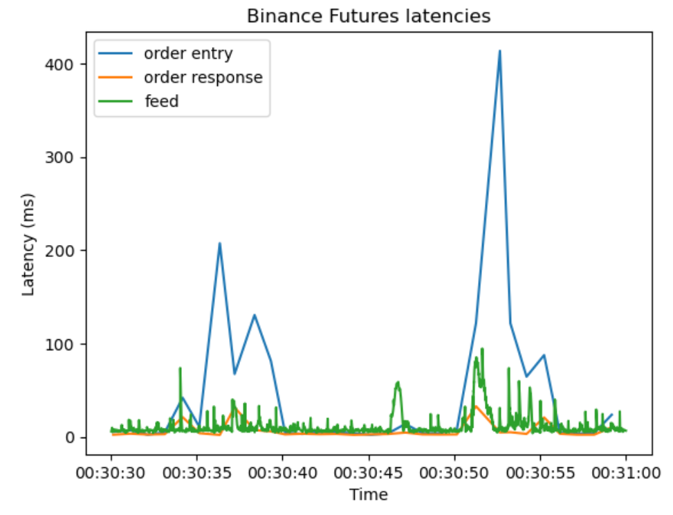

Latency Models
==============

Overview
--------

Latency is an important factor that you need to take into account when you backtest your HFT strategy.
HftBacktest has three types of latencies.

* Feed latency

This is the latency between the time the exchange sends the feed events such as order book change or trade and the time
it is received by the local.
This latency is dealt with through two different timestamps: local timestamp and exchange timestamp.

* Order entry latency

This is the latency between the time you send an order request and the time it is processed by the exchange's matching engine.

* Order response latency

This is the latency between the time the exchange's matching engine processes an order request and the time the order
response is received by the local. The response to your order fill is also affected by this type of latency.

Order Latency Models
--------------------

HftBacktest provides the following order latency models and you can also implement your own latency model.

ConstantLatency
~~~~~~~~~~~~~~~
It's the most basic model that uses constant latencies. You just set the latencies.

You can find details below.

* `ConstantLatency <https://docs.rs/hftbacktest/latest/hftbacktest/backtest/models/struct.ConstantLatency.html>`_
  and :meth:`constant_latency <hftbacktest.BacktestAsset.constant_latency>`

IntpOrderLatency
~~~~~~~~~~~~~~~~
This model interpolates order latency based on the actual order latency data.
This is the most accurate among the provided models if you have the data with a fine time interval.
You can collect the latency data by submitting unexecutable orders regularly.

You can find details below.

* `IntpOrderLatency <https://docs.rs/hftbacktest/latest/hftbacktest/backtest/models/struct.IntpOrderLatency.html>`_
  and :meth:`intp_order_latency <hftbacktest.BacktestAsset.intp_order_latency>`

**Data example**

.. code-block::

    req_ts (request timestamp at local), exch_ts (exchange timestamp), resp_ts (receipt timestamp at local), _padding
    1670026844751525000, 1670026844759000000, 1670026844762122000, 0
    1670026845754020000, 1670026845762000000, 1670026845770003000, 0

FeedLatency
~~~~~~~~~~~
If the live order latency data is unavailable, you can generate artificial order latency using feed latency.
Please refer to :doc:`this tutorial <tutorials/Order Latency Data>` for guidance.

Implement your own order latency model
~~~~~~~~~~~~~~~~~~~~~~~~~~~~~~~~~~~~~~
You need to implement the following trait.

* `LatencyModel <https://docs.rs/hftbacktest/latest/hftbacktest/backtest/models/trait.LatencyModel.html>`_

Please refer to `the latency model implementation <https://github.com/nkaz001/hftbacktest/blob/master/hftbacktest/src/backtest/models/latency.rs>`_.