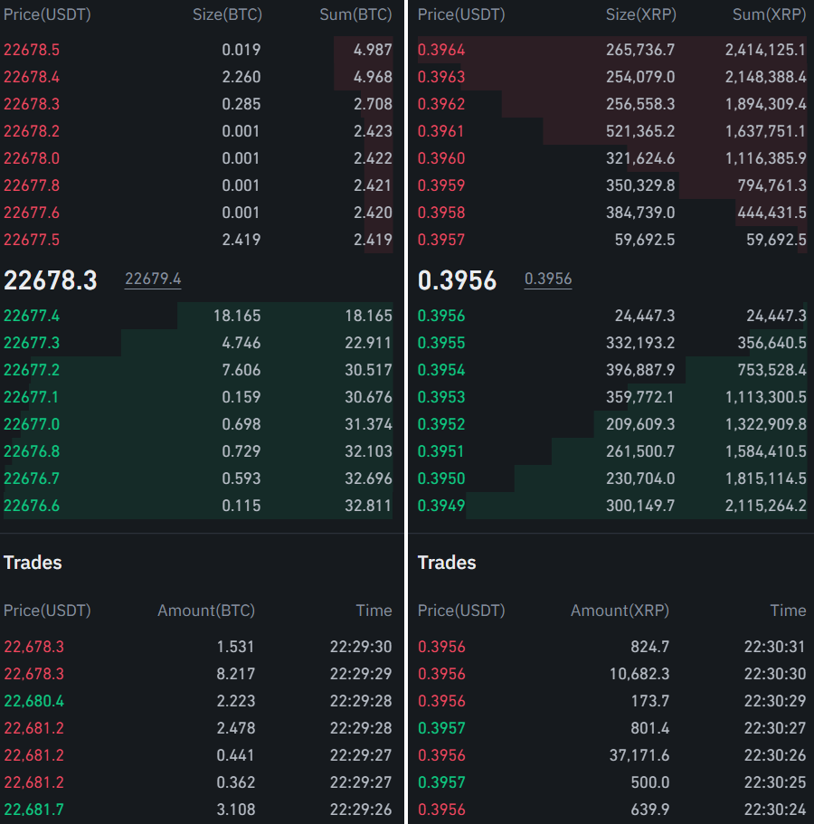
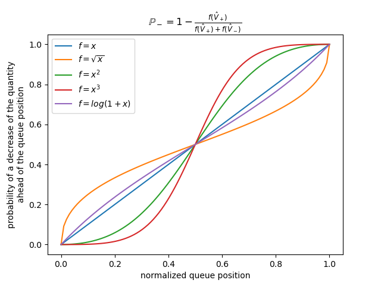
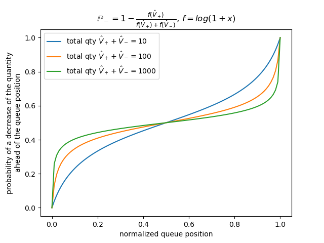
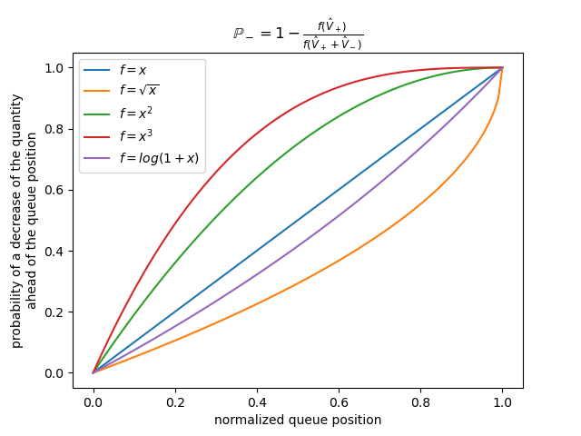
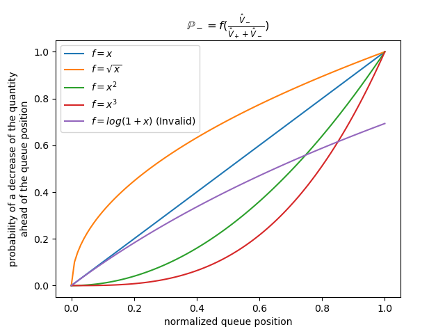

==========
Order Fill
==========

Exchange Models
===============

HftBacktest is a market-data replay-based backtesting tool, which means your order cannot make any changes to the
simulated market, no market impact is considered. Therefore, one of the most important assumptions is that your order is
small enough not to make any market impact. In the end, you must test it in a live market with real market participants
and adjust your backtesting based on the discrepancies between the backtesting results and the live outcomes.

Hftbacktest offers two types of exchange simulation. :ref:`order_fill_no_partial_fill_exchange` is the default exchange simulation where
no partial fills occur. :ref:`order_fill_partial_fill_exchange` is the extended exchange simulation that accounts for partial fills in
specific cases. Since the market-data replay-based backtesting cannot alter the market, some partial fill cases may
still be unrealistic, such as taking market liquidity. This is because even if your order takes market liquidity, the
replayed market data's market depth and trades cannot change. It is essential to understand the underlying assumptions
in each backtesting simulation.

.. _order_fill_no_partial_fill_exchange:

NoPartialFillExchange
---------------------

Conditions for Full Execution
~~~~~~~~~~~~~~~~~~~~~~~~~~~~~

Buy order in the order book

* Your order price >= the best ask price
* Your order price > sell trade price
* Your order is at the front of the queue && your order price == sell trade price

Sell order in the order book

* Your order price <= the best bid price
* Your order price < buy trade price
* Your order is at the front of the queue && your order price == buy trade price

Liquidity-Taking Order
~~~~~~~~~~~~~~~~~~~~~~

    Regardless of the quantity at the best, liquidity-taking orders will be fully executed at the best. Be aware that
    this may cause unrealistic fill simulations if you attempt to execute a large quantity.

You can find details below.

* `NoPartialFillExchange <https://docs.rs/hftbacktest/latest/hftbacktest/backtest/proc/struct.NoPartialFillExchange.html>`_
  and :meth:`no_partial_fill_exchange <hftbacktest.BacktestAsset.no_partial_fill_exchange>`

.. _order_fill_partial_fill_exchange:

PartialFillExchange
-------------------

Conditions for Full Execution
~~~~~~~~~~~~~~~~~~~~~~~~~~~~~

Buy order in the order book

* Your order price >= the best ask price
* Your order price > sell trade price

Sell order in the order book

* Your order price <= the best bid price
* Your order price < buy trade price

Conditions for Partial Execution
~~~~~~~~~~~~~~~~~~~~~~~~~~~~~~~~

Buy order in the order book

* Filled by (remaining) sell trade quantity: your order is at the front of the queue && your order price == sell
  trade price

Sell order in the order book

* Filled by (remaining) buy trade quantity: your order is at the front of the queue && your order price == buy trade
  price

Liquidity-Taking Order
~~~~~~~~~~~~~~~~~~~~~~

    Liquidity-taking orders will be executed based on the quantity of the order book, even though the best price and
    quantity do not change due to your execution. Be aware that this may cause unrealistic fill simulations if you
    attempt to execute a large quantity.

You can find details below.

* `PartialFillExchange <https://docs.rs/hftbacktest/latest/hftbacktest/backtest/proc/struct.PartialFillExchange.html>`_
  and :meth:`partial_fill_exchange <hftbacktest.BacktestAsset.partial_fill_exchange>`

Queue Models
============

Knowing your order's queue position is important to achieve accurate order fill simulation in backtesting depending on
the liquidity of an order book and trading activities.
If an exchange doesn't provide Market-By-Order, you have to guess it by modeling.
HftBacktest currently only supports Market-By-Price that is most crypto exchanges provide and it provides the following
queue position models for order fill simulation.

Please refer to the details at `Models <https://docs.rs/hftbacktest/latest/hftbacktest/backtest/models/index.html>`.

RiskAverseQueueModel
--------------------

This model is the most conservative model in terms of the chance of fill in the queue.
The decrease in quantity by cancellation or modification in the order book happens only at the tail of the queue so your
order queue position doesn't change.
The order queue position will be advanced only if a trade happens at the price.

You can find details below.

* `RiskAdverseQueueModel <https://docs.rs/hftbacktest/latest/hftbacktest/backtest/models/struct.RiskAdverseQueueModel.html>`_
  and :meth:`risk_adverse_queue_model <hftbacktest.BacktestAsset.risk_adverse_queue_model>`

.. _order_fill_prob_queue_model:

ProbQueueModel
--------------
Based on a probability model according to your current queue position, the decrease in quantity happens at both before
and after the queue position.
So your queue position is also advanced according to the probability.
This model is implemented as described in

* https://quant.stackexchange.com/questions/3782/how-do-we-estimate-position-of-our-order-in-order-book
* https://rigtorp.se/2013/06/08/estimating-order-queue-position.html

You can find details below.

* `ProbQueueModel <https://docs.rs/hftbacktest/latest/hftbacktest/backtest/models/struct.ProbQueueModel.html>`_

* `PowerProbQueueFunc <https://docs.rs/hftbacktest/latest/hftbacktest/backtest/models/struct.PowerProbQueueFunc.html>`_
  and :meth:`power_prob_queue_model <hftbacktest.BacktestAsset.power_prob_queue_model>`

* `PowerProbQueueFunc2 <https://docs.rs/hftbacktest/latest/hftbacktest/backtest/models/struct.PowerProbQueueFunc2.html>`_
  and :meth:`power_prob_queue_model2 <hftbacktest.BacktestAsset.power_prob_queue_model2>`

* `PowerProbQueueFunc3 <https://docs.rs/hftbacktest/latest/hftbacktest/backtest/models/struct.PowerProbQueueFunc3.html>`_
  and :meth:`power_prob_queue_model3 <hftbacktest.BacktestAsset.power_prob_queue_model3>`

* `LogProbQueueFunc <https://docs.rs/hftbacktest/latest/hftbacktest/backtest/models/struct.LogProbQueueFunc.html>`_
  and :meth:`log_prob_queue_model <hftbacktest.BacktestAsset.log_prob_queue_model>`

* `LogProbQueueFunc2 <https://docs.rs/hftbacktest/latest/hftbacktest/backtest/models/struct.LogProbQueueFunc2.html>`_
  and :meth:`log_prob_queue_model2 <hftbacktest.BacktestAsset.log_prob_queue_model2>`

By default, three variations are provided. These three models have different probability profiles.

The function f = log(1 + x) exhibits a different probability profile depending on the total quantity at the price level,
unlike power functions.

When you set the function f, it should be as follows.

* The probability at 0 should be 0 because if the order is at the head of the queue, all decreases should happen after
  the order.
* The probability at 1 should be 1 because if the order is at the tail of the queue, all decreases should happen before
  the order.

You can see the comparison of the models :doc:`here <tutorials/Probability Queue Models>`.

Implement a custom queue model
------------------------------
You need to implement the following traits in Rust based on your usage requirements.

* `QueueModel <https://docs.rs/hftbacktest/latest/hftbacktest/backtest/models/trait.QueueModel.html>`_
* `L3QueueModel <https://docs.rs/hftbacktest/latest/hftbacktest/backtest/models/trait.L3QueueModel.html>`_

Please refer to `the queue model implementation <https://github.com/nkaz001/hftbacktest/blob/master/hftbacktest/src/backtest/models/queue.rs>`_.

References
==========
This is initially implemented as described in the following articles.

* http://www.math.ualberta.ca/~cfrei/PIMS/Almgren5.pdf
* https://quant.stackexchange.com/questions/3782/how-do-we-estimate-position-of-our-order-in-order-book
